### Daniel Alejandro Castro Escobar - A00398005

**1. Obtención del código fuente**

Inicialmente, se clona el repositorio de GitHub que contiene los archivos de configuración de Terraform. Esto permite obtener localmente las definiciones de infraestructura necesarias para el despliegue. El comando empleado es:

```bash
git clone https://github.com/ChristianFlor/azfunction-tf.git
```

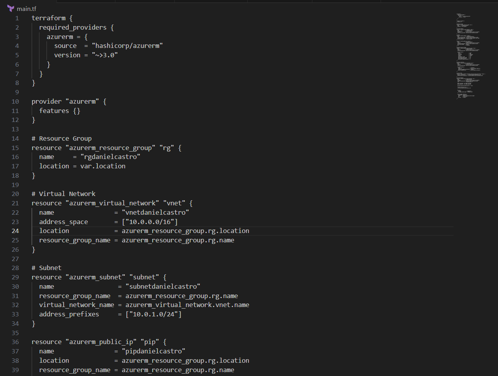

**2. Acceso al directorio de trabajo**

Una vez clonado el repositorio, se navega al directorio que alberga el archivo principal de Terraform y los archivos complementarios, para que los comandos de Terraform se ejecuten en el contexto correcto.

```bash
cd D:\Documentos\Universidad\Semestre 8\Plataformas II\VM Terraform>
```

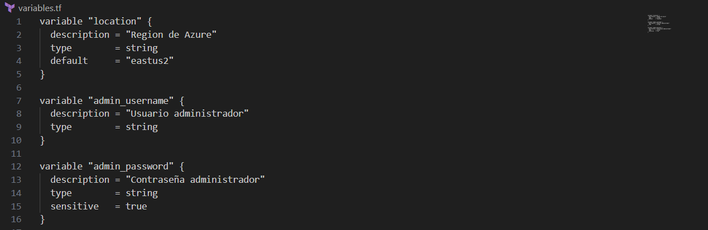

**3. Inicialización de Terraform**

Se ejecuta el comando `terraform init` con el fin de preparar el entorno de trabajo. Este comando descarga los proveedores necesarios y configura el backend para el estado de Terraform.

```bash
terraform init
```

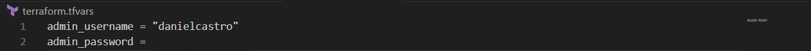

**4. Despliegue inicial**

A continuación, se procede a ejecutar `terraform apply` para crear los recursos definidos. Durante la ejecución, Terraform solicita confirmación mostrando el plan de cambios. Es necesario responder afirmativamente (`yes`). Sin embargo, el despliegue falla debido a un error relacionado con la suscripción de Azure y la zona geográfica predeterminada.

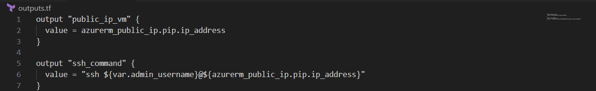
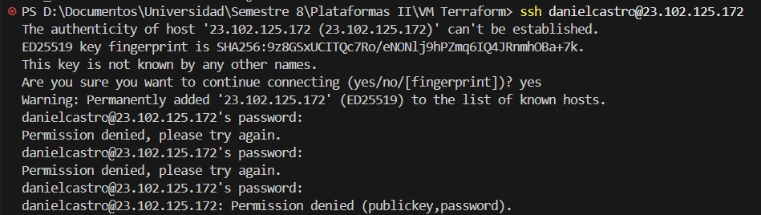
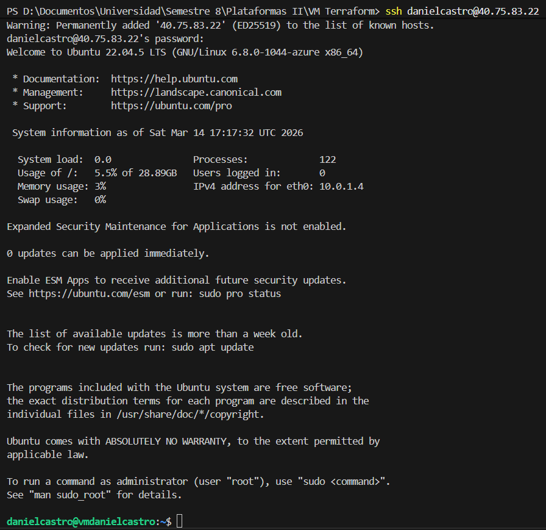

En este caso, el error se debe a que la región configurada por defecto en los archivos de variables no está habilitada para la suscripción de estudiante utilizada.

```bash
terraform apply
```

**5. Corrección de la región**

Para solucionar el error, se modifica la variable `location` en el archivo `variables.tf`, estableciendo la región East US 2 (`eastus2`), que es compatible con la suscripción de estudiante y posee la disponibilidad de servicios requerida.

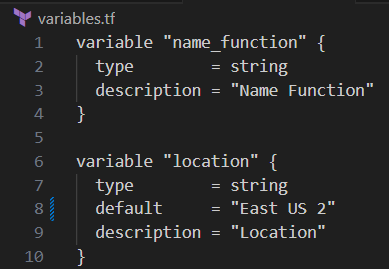

Tras este ajuste, se repite el comando:

```bash
terraform apply
```

Ahora sí permite completar exitosamente la creación de la infraestructura.

**6. Obtención de URL del servicio desplegado**

Al finalizar el despliegue, Terraform muestra en la salida los valores definidos en `outputs.tf`. Entre ellos, se encuentra la URL pública del recurso creado, que permite acceder al servicio en ejecución.

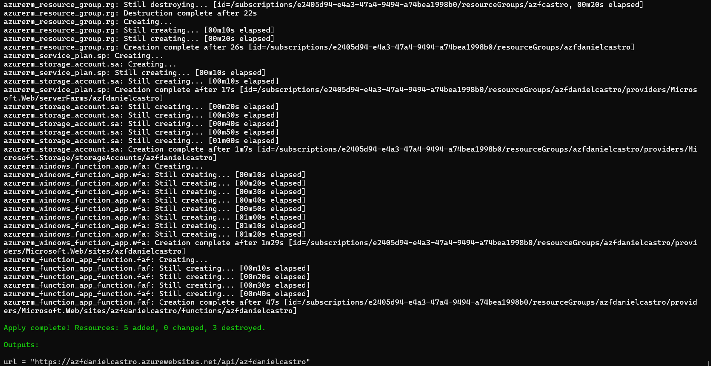

**7. Verificación del funcionamiento de la aplicación**

Al acceder mediante un navegador a la URL, se observa un mensaje indicando que la función HTTP se había ejecutado correctamente:

> "Esta función HTTP se ejecutó correctamente. Pase un nombre en la cadena de consulta o en el cuerpo de la solicitud para obtener una respuesta personalizada."

Así se comprueba que el recurso de tipo Function App está operando y responde a peticiones HTTP.

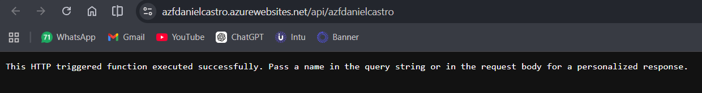

**8. Inspección en Azure Portal**

Se ingresa al portal de Azure y se localiza el grupo de recursos creado, cuyo nombre fue definido en la configuración.

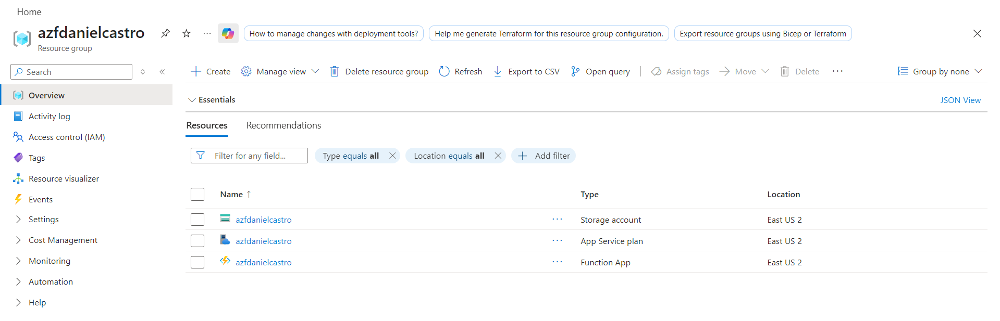

Dentro de este grupo se observan todos los recursos generados automáticamente por Terraform:

- Storage Account  
- App Service Plan  
- Function App  

Esto evidencia que la infraestructura desplegada coincide con la definida en el código.

**9. Acceso al dominio de la Function App**

Desde la página de la Function App en el portal, se accede a su dominio predeterminado, comprobando nuevamente que la aplicación está disponible públicamente y responde como se espera.

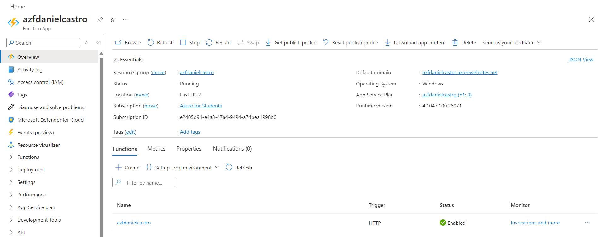
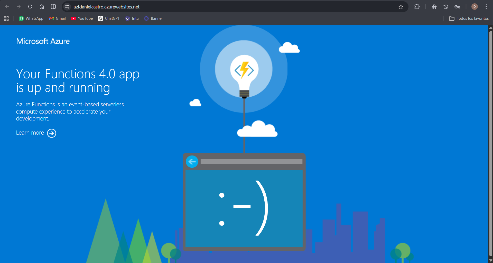
